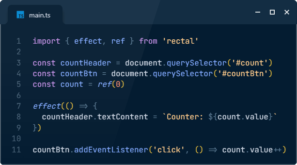
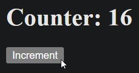

# rectal

[![npm version][npm-version-src]][npm-version-href]
[![npm downloads][npm-downloads-src]][npm-downloads-href]
[![bundle][bundle-src]][bundle-href]
[![JSDocs][jsdocs-src]][jsdocs-href]
[![License][license-src]][license-href]





Rectal ~~re~~ **activity** in 429 bytes! (`gzip -c dist/index.mjs | wc -c`)

Look to [./test/index.test.ts](./test/index.test.ts) for code samples

## Supported Frameworks

```plaintext
- Vanilla
- Vue
- React
- Preact
- Angular
- Solid
- Svelte
- Qwik
- Lit
- Astro
- Next
- Nuxt
- Easy integration with:
  - KnockoutJS
  - Backbone
  - Angular.js
  - Angular
  - RxJS
  - Elm
  - React
  - s-js
  - Redux
  - Redux Toolkit
  - Mobx
  - Focal
  - XState
  - Reatom
  - Tanstack Query
  - Zustand
  - Recoil
  - MOL
```

## License

[MIT](./LICENSE) License © [SeryiBaran](https://github.com/SeryiBaran)

<!-- Badges -->

[npm-version-src]: https://img.shields.io/npm/v/rectal?style=flat&colorA=080f12&colorB=1fa669
[npm-version-href]: https://npmjs.com/package/rectal
[npm-downloads-src]: https://img.shields.io/npm/dm/rectal?style=flat&colorA=080f12&colorB=1fa669
[npm-downloads-href]: https://npmjs.com/package/rectal
[bundle-src]: https://img.shields.io/bundlephobia/minzip/rectal?style=flat&colorA=080f12&colorB=1fa669&label=minzip
[bundle-href]: https://bundlephobia.com/result?p=rectal
[license-src]: https://img.shields.io/github/license/SeryiBaran/rectal.svg?style=flat&colorA=080f12&colorB=1fa669
[license-href]: https://github.com/SeryiBaran/rectal/blob/main/LICENSE
[jsdocs-src]: https://img.shields.io/badge/jsdocs-reference-080f12?style=flat&colorA=080f12&colorB=1fa669
[jsdocs-href]: https://www.jsdocs.io/package/rectal
